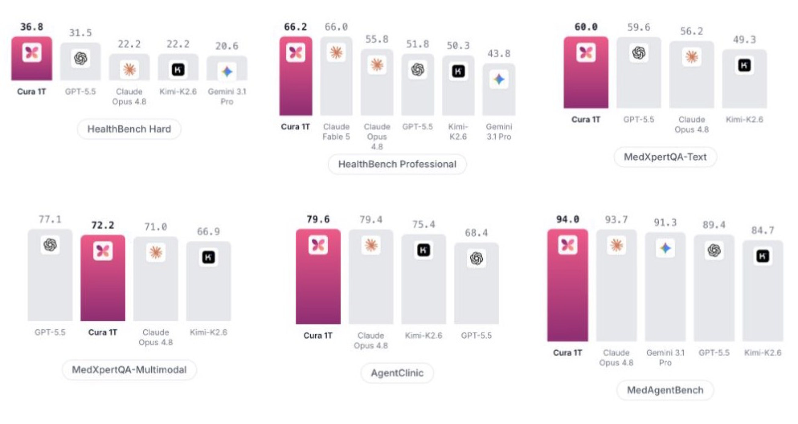
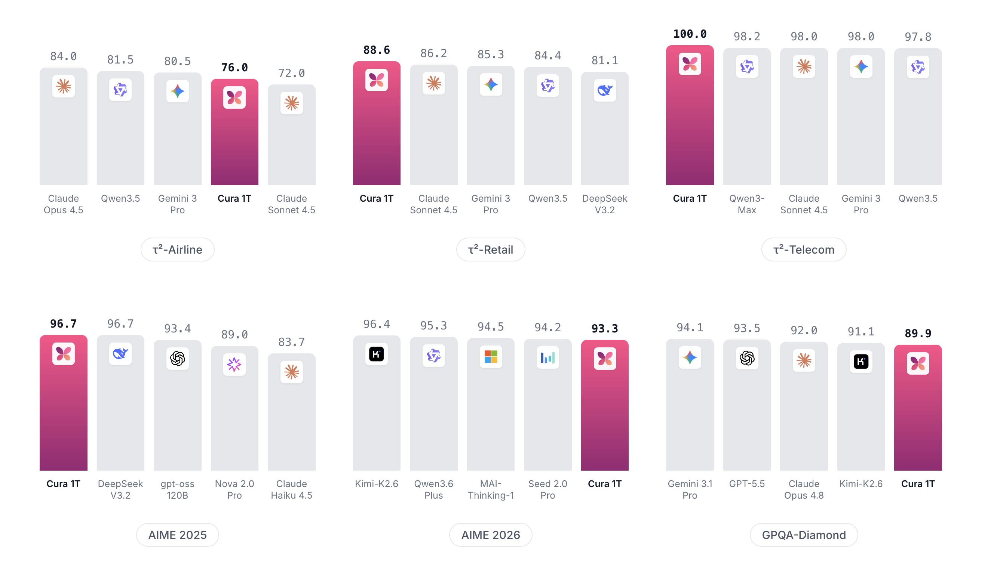

# actAVA Cura 1T

<div align="center">

</div>
<p align="center">
    🌐 Learn more at <a href="https://actava.ai/cura" target="_blank">actava.ai/cura</a>.
    <br>
    🔑 Get an API key: <a href="https://forms.gle/hLfVUq1pBPRNojkj8" target="_blank">join the waitlist</a>.
    <br>
    📍 Use the Cura API — <a href="https://actava.ai/cura/docs" target="_blank">API documentation</a> (OpenAI-compatible).
    <br>
    📖 Check out the Cura 1T <a href="https://actava.ai/cura/cura-technical-report.pdf" target="_blank">Technical report</a>.
</p>

## Introduction

**Cura 1T** is actAVA's one-trillion-parameter healthcare model. Fine-tuned from Kimi-K2.6 through
recursive self-improvement — each round, a training agent plans a target capability, trains the
model, evaluates benchmark trajectories, and refines the data mixture from observed failures, with
humans gating every keep-or-revert decision — it handles the work healthcare models are actually
asked to do:

- **Patient consultation**: open-ended health conversations, graded hard by physician-written rubrics
- **Clinical reasoning over text and medical images**: expert-exam-level diagnosis, treatment, and basic-science questions (text + vision, 256K context)
- **Interactive diagnosis and EHR tool use**: multi-turn consultations and FHIR-based record operations, end to end



Cura 1T leads frontier models on **5 of 6 healthcare benchmark panels**: HealthBench Hard (36.8 vs
31.5 for GPT-5.5), HealthBench Professional (66.2, edging Claude Fable 5's 66.0), MedXpertQA-Text
(60.0), AgentClinic (79.6 vs 79.4 for Claude Opus 4.8), and MedAgentBench (94.0 vs 93.7 for Claude
Opus 4.8); GPT-5.5 keeps the lead on MedXpertQA-Multimodal (77.1 vs 72.2). Against its base model
Kimi-K2.6 the gains are wide: +14.6 points on HealthBench Hard, +15.9 on HealthBench Professional,
+8.6 on MedXpertQA overall, +9.3 on MedAgentBench, and +4.2 on AgentClinic.



Specialization does not cost general capability: Cura 1T stays frontier-competitive out of domain —
96.7 on AIME 2025, 89.9 on GPQA-Diamond, and top scores on τ²-bench Retail (88.6) and Telecom
(100.0).

For more detail, check the [technical report](https://actava.ai/cura/cura-technical-report.pdf).

> Reported scores use the tech report's protocol — pass@1 with sampling (temperature 1.0 for
> HealthBench, MedXpertQA, and AgentClinic; MedXpertQA overall = 2,450 text + 2,000 multimodal
> questions). `cura-eval` below defaults to greedy decoding for reproducible measurement — pass
> `--temperature 1.0` to match the report's setting.

## API

The Cura API is OpenAI-compatible: base URL `https://inference.actava.ai/v1`, model id
`actava/cura-soar`, bearer auth with `ACTAVA_API_KEY`
([join the waitlist](https://forms.gle/hLfVUq1pBPRNojkj8) for a key).

```bash
curl https://inference.actava.ai/v1/chat/completions \
  -H "Authorization: Bearer $ACTAVA_API_KEY" \
  -H "Content-Type: application/json" \
  -d '{
    "model": "actava/cura-soar",
    "messages": [{"role": "user", "content": "Summarize the escalation criteria for chest pain triage."}]
  }'
```

Existing OpenAI SDK code works by changing the base URL and model id — see the
[API documentation](https://actava.ai/cura/docs) for streaming, vision, tool calling, and thinking
mode. Ready-made configs for local agents (**Codex, Claude Code, Hermes, OpenClaw, Cline, Roo
Code**) are in [`examples/integrations/`](examples/integrations/).

## Evaluation with cura-eval

This repo contains **`cura-eval`**, the medical evaluation harness used to evaluate Cura 1T. It is
**model-agnostic**: every benchmark drives the model under test through a plain OpenAI-compatible
chat-completions endpoint, so the same commands evaluate Cura, OpenAI, OpenRouter models, or
anything you serve locally with vLLM / SGLang / Ollama / LM Studio.

| Benchmark | Command | Grading | Needs |
|---|---|---|---|
| HealthBench (hard / regular / consensus) | `cura-eval healthbench` | LLM rubric judge | judge key |
| HealthBench Professional | `cura-eval healthbench-professional` | LLM rubric judge + length adjustment | judge key |
| MedXpertQA — Text | `cura-eval medxpertqa --subset text` | exact letter match (deterministic) | — |
| MedXpertQA — MM | `cura-eval medxpertqa --subset mm` | exact letter match (deterministic) | vision endpoint |
| AgentClinic (MedQA / NEJM) | `cura-eval agentclinic` | simulated consultation, moderator-graded | judge key (NPCs) |
| MedAgentBench | `cura-eval medagentbench` | agentic FHIR tasks, deterministic graders | FHIR docker server |

> **Protocol notes.** MedAgentBench runs on native OpenAI function calling (`fhir_get` /
> `fhir_post` / `finish`) rather than upstream's strict GET/POST/FINISH text protocol, so scores
> are not directly comparable to the published leaderboard — it measures native tool-calling
> agentic ability on the same tasks and graders. AgentClinic follows the upstream "prompt"
> protocol and grading control flow.

### Install

```bash
pip install -e .            # or: uv pip install -e .
pip install -e ".[images]"  # + Pillow, for NEJM image downscaling in agentclinic
```

Python ≥ 3.10.

### Quickstart — evaluate Cura

```bash
export ACTAVA_API_KEY=...   # candidate model
export OPENAI_API_KEY=...   # judge for the rubric-graded benchmarks

# Rubric-judged health conversations (10-example smoke)
cura-eval healthbench --limit 10

# Board-exam MCQ, judge-free
cura-eval medxpertqa --subset text --limit 50

# Multimodal MCQ (Cura is text + vision)
cura-eval medxpertqa --subset mm --limit 20

# Simulated clinical consultations
cura-eval agentclinic --dataset MedQA --limit 10

# Agentic FHIR tasks (start the server first)
docker run -p 8080:8080 jyxsu6/medagentbench:latest
cura-eval medagentbench --limit 10
```

Defaults target the Cura API: base URL `https://inference.actava.ai/v1`, model
`actava/cura-soar`, bearer key from `ACTAVA_API_KEY`.

### Evaluate any OpenAI-compatible endpoint

The candidate model is just `--base-url` + `--model` + `--api-key-env`:

```bash
# Local vLLM
cura-eval medxpertqa --base-url http://localhost:8000/v1 \
    --model meta-llama/Llama-3.3-70B-Instruct --api-key-env VLLM_API_KEY

# Ollama
cura-eval healthbench --base-url http://localhost:11434/v1 \
    --model llama3.1 --api-key-env OLLAMA_API_KEY --limit 20

# OpenRouter
cura-eval healthbench-professional --base-url https://openrouter.ai/api/v1 \
    --model moonshotai/kimi-k2.6 --api-key-env OPENROUTER_API_KEY

# OpenAI
cura-eval agentclinic --base-url https://api.openai.com/v1 \
    --model gpt-5.5 --api-key-env OPENAI_API_KEY --temperature none
```

Notes:

- For keyless local servers, set the key env var to any placeholder (e.g. `EMPTY`).
- `--temperature none` omits the field for reasoning endpoints that reject sampling params.
- `--extra-body '<json>'` forwards provider-specific fields verbatim (OpenRouter
  `provider`/`reasoning` routing, Cura `thinking`, …).
- The **judge** is equally model-agnostic: `--judge-model`, `--judge-base-url`,
  `--judge-api-key-env`. Defaults: `gpt-4.1-2025-04-14` (HealthBench), `gpt-5.4`
  (HealthBench Professional), `gpt-5.5` (AgentClinic NPCs + moderator) on the official
  OpenAI API. Keep the judge fixed when comparing candidate models.

### Output

Each run writes a fresh directory under `--output-dir` (default `results/`):

- `responses.jsonl` — one row per example:
  `{<id>, "messages": [...], "response": ..., "score": {...}}`. `messages` is the full
  conversation including the generated assistant turn, with any chain-of-thought lifted into
  `reasoning_content` — graded runs double as SFT-ready thinking/tool-calling data.
- `summary.json` — headline score, per-category breakdowns, and the exact run config.

Headline metrics: HealthBench = mean rubric reward (0–1); HealthBench Professional = mean
length-adjusted reward (raw also reported); MedXpertQA = exact-match accuracy; AgentClinic =
diagnostic accuracy; MedAgentBench = task success rate.

### Python API

```python
import asyncio
from cura_eval import ChatClient
from cura_eval.benchmarks.medxpertqa import run_medxpertqa

candidate = ChatClient(
    model="actava/cura-soar",
    base_url="https://inference.actava.ai/v1",
    api_key_env="ACTAVA_API_KEY",
)
rows, summary = asyncio.run(run_medxpertqa(candidate, subset="text", limit=20))
print(summary)
```

### Repo layout

```
src/cura_eval/
  client.py                 # the OpenAI-compatible seam (ChatClient)
  loaders.py                # HealthBench / HBP / MedXpertQA dataset loaders (HF)
  judge.py                  # rubric judge (simple-evals template) + scoring
  mcq.py                    # deterministic MCQ letter extraction
  rows.py                   # per-example row schema + run writers
  cli.py                    # `cura-eval` CLI
  benchmarks/
    healthbench.py healthbench_professional.py medxpertqa.py
    medagentbench/          # tools, FHIR client, vendored tasks + graders
    agentclinic/            # doctor, NPCs, episode loop, scenario fetch
examples/                   # endpoint recipes + agent integration configs
tests/                      # offline unit tests (no network, no keys)
```

## Attribution

The evaluation harness ports and builds on:

- **HealthBench** rubric judge template and scoring — [openai/simple-evals](https://github.com/openai/simple-evals) (MIT)
- **HealthBench Professional** — [openai/healthbench-professional](https://huggingface.co/datasets/openai/healthbench-professional)
- **MedXpertQA** — [TsinghuaC3I/MedXpertQA](https://huggingface.co/datasets/TsinghuaC3I/MedXpertQA) (Zuo et al., 2025)
- **AgentClinic** — [SamuelSchmidgall/AgentClinic](https://github.com/SamuelSchmidgall/AgentClinic) (MIT; Schmidgall et al., 2024). NPC prompts and episode control flow are upstream's; scenario data is fetched from the upstream repo at run time.
- **MedAgentBench** — [stanfordmlgroup/MedAgentBench](https://github.com/stanfordmlgroup/MedAgentBench) (Jiang et al., 2025). Task data and reference-solution graders are vendored; see the protocol note above.

Benchmark datasets remain under their upstream licenses/terms; this repo's code is licensed
under Apache 2.0 (see [LICENSE](LICENSE) and [NOTICE](NOTICE)).

## Disclaimer

Cura 1T is a research model — not a medical service, and not a substitute for a clinician.
Benchmark scores do not establish safety for unsupervised clinical use.

## Citation

If you use Cura 1T or this evaluation harness, please cite:

```bibtex
@techreport{actava2026cura,
      title={Cura 1T: Specialized Model for Agentic Healthcare},
      author={{actAVA AI Team}},
      institution={actAVA},
      year={2026},
      url={https://actava.ai/cura/cura-technical-report.pdf},
}
```
